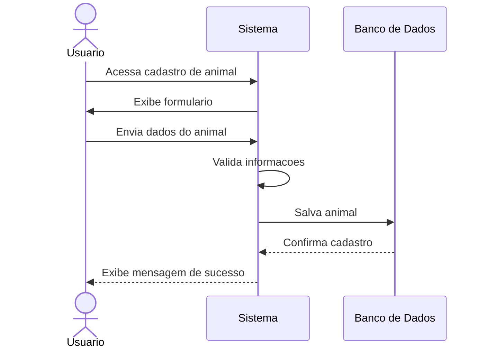
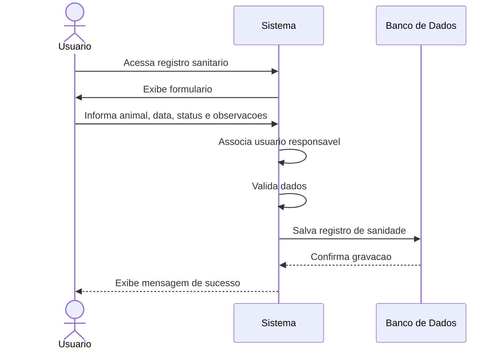
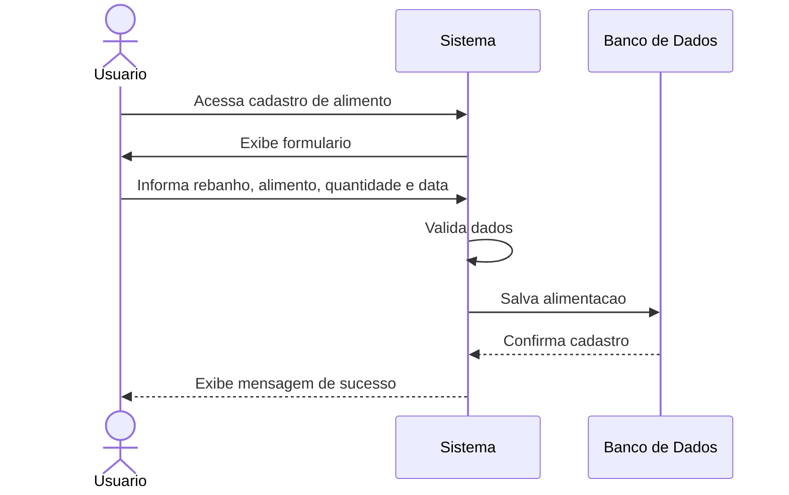
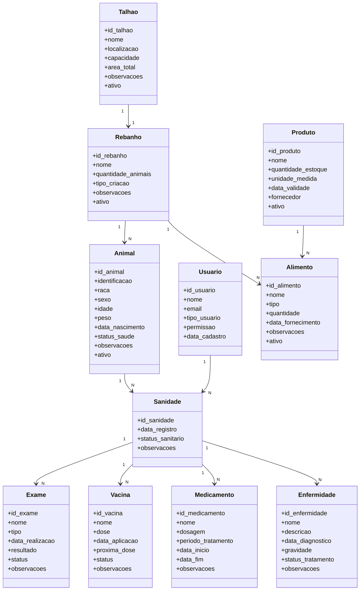

# Documento de Visao - Sistema de Gerenciamento de Rebanho

## 1. Cenario do Projeto

O projeto tem como objetivo desenvolver um sistema web para auxiliar no gerenciamento de rebanhos em uma propriedade rural. Muitas atividades relacionadas ao controle de animais, alimentacao, estoque e saude ainda podem ser feitas manualmente, em cadernos ou planilhas, o que dificulta a organizacao das informacoes e o acompanhamento historico dos dados.

Nesse cenario, o sistema proposto busca centralizar as principais informacoes do rebanho, permitindo o cadastro de animais, rebanhos, talhoes, produtos, alimentos e registros sanitarios. Com isso, o usuario consegue acompanhar melhor a situacao dos animais, controlar os produtos utilizados e registrar eventos importantes, como vacinas, exames, medicamentos e enfermidades.

O sistema e voltado para produtores rurais, administradores de fazenda ou responsaveis pelo acompanhamento do rebanho. A aplicacao permite que os dados sejam consultados, cadastrados, editados e excluidos de forma organizada.

## 2. Objetivos

### 2.1 Objetivo Geral

Desenvolver um sistema de gerenciamento de rebanho que facilite o controle dos animais, da alimentacao, do estoque e da saude animal.

### 2.2 Objetivos Especificos

- Cadastrar e consultar animais.
- Organizar animais por rebanho.
- Associar rebanhos a talhoes.
- Registrar alimentacao fornecida aos rebanhos.
- Controlar produtos utilizados na propriedade.
- Registrar historico sanitario dos animais.
- Registrar exames, vacinas, medicamentos e enfermidades.
- Permitir o gerenciamento de usuarios do sistema.

## 3. Usuarios do Sistema

- Administrador: possui acesso ao gerenciamento geral do sistema.
- Usuario comum: realiza cadastros, consultas e atualizacoes relacionadas ao rebanho.

## 4. Principais Funcionalidades

- Login de usuarios.
- Cadastro de animais.
- Cadastro de rebanhos.
- Cadastro de talhoes.
- Cadastro de produtos.
- Registro de alimentacao.
- Registro sanitario dos animais.
- Cadastro de exames, vacinas, medicamentos e enfermidades.
- Consulta de informacoes em listas e dashboard.

## 5. Modelagem Conceitual

A modelagem conceitual representa as principais entidades do sistema e seus relacionamentos.

### 5.1 Entidades Principais

**Usuario**

Representa o usuario que acessa o sistema. Pode ser administrador ou usuario comum.

**Talhao**

Representa uma area fisica da propriedade rural.

**Rebanho**

Representa um grupo de animais. Cada rebanho esta associado a um talhao.

**Animal**

Representa cada animal cadastrado no sistema.

**Produto**

Representa produtos disponiveis no estoque.

**Alimento**

Representa o fornecimento de alimento para um rebanho.

**Sanidade**

Representa o registro de saude de um animal.

**Exame**

Representa exames associados a um registro sanitario.

**Vacina**

Representa vacinas aplicadas ao animal.

**Medicamento**

Representa medicamentos utilizados em tratamentos.

**Enfermidade**

Representa doencas ou problemas de saude identificados.

### 5.2 Modelo Conceitual Simplificado

```text
Usuario 1 ---- N Sanidade

Talhao 1 ---- 1 Rebanho

Rebanho 1 ---- N Animal
Rebanho 1 ---- N Alimento

Produto 1 ---- N Alimento

Animal 1 ---- N Sanidade

Sanidade 1 ---- N Exame
Sanidade 1 ---- N Vacina
Sanidade 1 ---- N Medicamento
Sanidade 1 ---- N Enfermidade
```

## 6. Casos de Uso Descritivos

### 6.1 Caso de Uso 1: Cadastrar Animal

**Nome:** Cadastrar Animal

**Ator principal:** Usuario

**Objetivo:** Permitir que o usuario cadastre um novo animal no sistema.

**Pre-condicoes:**

- O usuario deve estar autenticado.
- Deve existir pelo menos um rebanho cadastrado.

**Fluxo principal:**

1. O usuario acessa a tela de cadastro de animal.
2. O sistema exibe o formulario.
3. O usuario informa identificacao, raca, sexo, idade, peso, data de nascimento, status de saude e rebanho.
4. O sistema valida os dados.
5. O sistema salva o animal no banco de dados.
6. O sistema exibe uma mensagem de sucesso.

**Fluxos alternativos:**

- Se algum campo obrigatorio estiver vazio, o sistema exibe erro.
- Se o peso for negativo, o sistema impede o cadastro.
- Se a data de nascimento for futura, o sistema impede o cadastro.

**Pos-condicao:**

O animal fica cadastrado e vinculado a um rebanho.

### 6.2 Caso de Uso 2: Registrar Sanidade do Animal

**Nome:** Registrar Sanidade do Animal

**Ator principal:** Usuario

**Objetivo:** Registrar informacoes de saude de um animal.

**Pre-condicoes:**

- O usuario deve estar autenticado.
- O animal deve estar cadastrado.

**Fluxo principal:**

1. O usuario acessa a tela de sanidade.
2. O sistema exibe o formulario de registro sanitario.
3. O usuario seleciona o animal.
4. O usuario informa a data, o status sanitario e as observacoes.
5. O sistema associa o registro ao usuario responsavel.
6. O sistema valida os dados.
7. O sistema salva o registro sanitario.
8. O sistema exibe mensagem de sucesso.

**Fluxos alternativos:**

- Se o animal nao for selecionado, o sistema exibe erro.
- Se os dados obrigatorios nao forem preenchidos, o sistema solicita correcao.

**Pos-condicao:**

O historico sanitario do animal e atualizado.

### 6.3 Caso de Uso 3: Registrar Alimentacao do Rebanho

**Nome:** Registrar Alimentacao do Rebanho

**Ator principal:** Usuario

**Objetivo:** Registrar o fornecimento de alimento para determinado rebanho.

**Pre-condicoes:**

- O usuario deve estar autenticado.
- Deve existir um rebanho cadastrado.
- O produto pode estar cadastrado, caso seja usado no controle de estoque.

**Fluxo principal:**

1. O usuario acessa a tela de cadastro de alimento.
2. O sistema exibe o formulario.
3. O usuario seleciona o rebanho.
4. O usuario informa nome do alimento, tipo, quantidade e data de fornecimento.
5. O usuario pode selecionar um produto do estoque.
6. O sistema valida os dados.
7. O sistema salva o registro de alimentacao.
8. O sistema exibe mensagem de sucesso.

**Fluxos alternativos:**

- Se a quantidade for negativa, o sistema impede o cadastro.
- Se o rebanho nao for informado, o sistema exibe erro.

**Pos-condicao:**

A alimentacao fica registrada e vinculada ao rebanho.

## 7. Diagramas de Sequencia

### 7.1 Diagrama de Sequencia: Cadastrar Animal



### 7.2 Diagrama de Sequencia: Registrar Sanidade



### 7.3 Diagrama de Sequencia: Registrar Alimentacao



## 8. Diagrama de Classes



